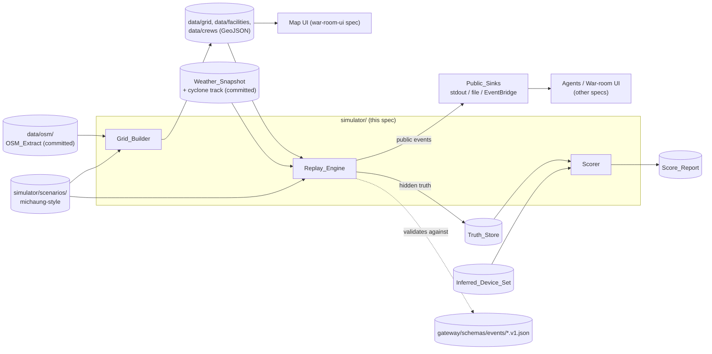
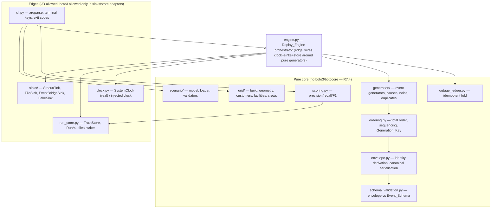
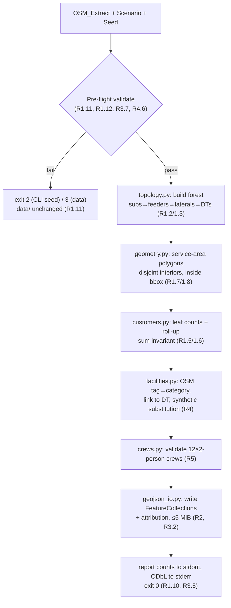
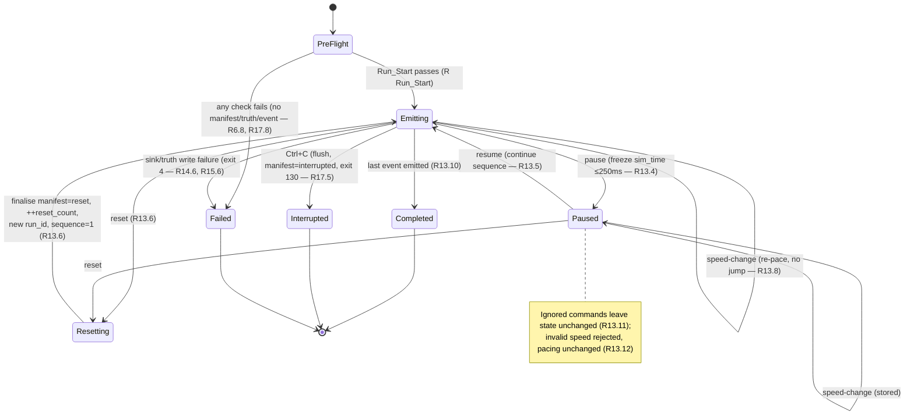
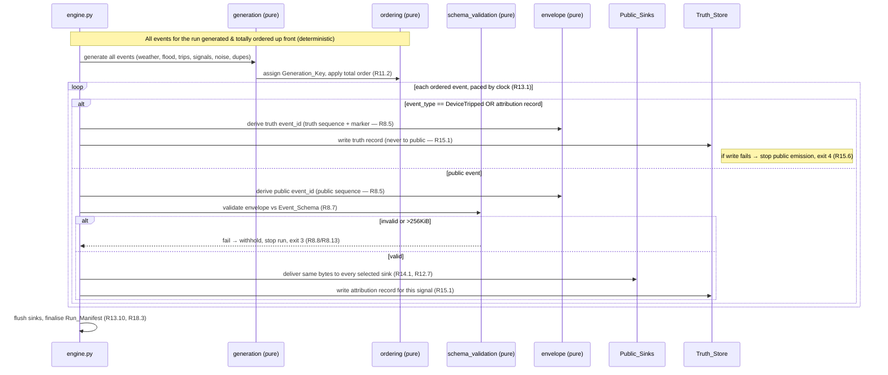
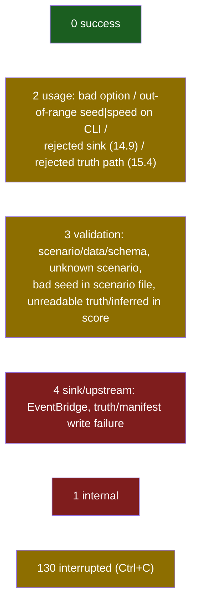
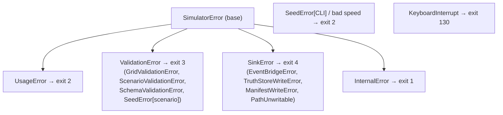
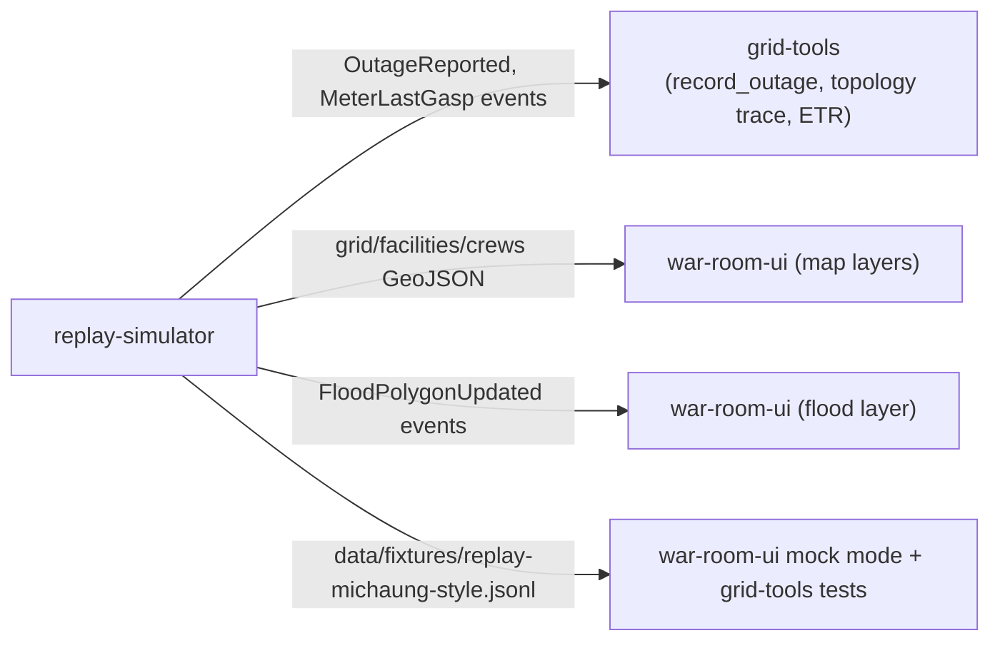

# Design Document

## Overview

The replay simulator is a **deterministic, offline, pure-core** Python package (`simulator/`) that:

1. **Builds** a synthetic radial distribution grid over Chennai from a committed OpenStreetMap extract plus a seed, and writes it as RFC 7946 GeoJSON under `data/` (`Grid_Builder`).
2. **Replays** a versioned `Scenario` (`michaung-style`) as a time-ordered, deterministic stream of domain events (`Replay_Engine`), pacing emission by a `Speed_Multiplier` and responding to pause/resume/reset/speed commands.
3. **Isolates** the hidden damage truth (`DeviceTripped` events and per-signal attributions) in a `Truth_Store` that reaches no public sink.
4. **Scores** an agent team's inferred failed devices against that hidden truth (`Scorer`).

The design follows the org rule *small pure core, thin edges*. All decision logic — grid construction, scenario validation, event generation, ordering, canonical serialisation, the outage ledger and scoring — lives in pure modules that import neither `boto3` nor `botocore` (R7.4, security rule). Only three edge modules touch I/O: the CLI (argument parsing, terminal), the sinks (stdout/file/EventBridge), and the run store (Truth_Store, Run_Manifest files). Determinism is achieved by seeding every generator from `(Seed, Scenario ID)` only and deriving all identity from `(Scenario ID, Scenario content hash, Seed, reset count, sequence)` — never from wall-clock, PID, hostname or OS entropy (R12.5, R8.5).

### Design goals traceability

| Goal | Requirements | Mechanism |
|---|---|---|
| Reproducible grid | R1, R2, R12.8 | Seeded builder, byte-identical GeoJSON writer |
| Standard, map-loadable data | R2, R3, R4, R5 | RFC 7946 GeoJSON ≤ 5 MiB, ODbL attribution, `synthetic` flag |
| Deterministic replay | R8, R11, R12 | Derived identity, total event order, seeded RNG, injected clock |
| Offline | R7 | Committed OSM extract + Weather_Snapshot; no network in pure core |
| Hidden-truth isolation | R10, R15, R18.5 | Separate Truth_Store; public schemas forbid truth fields |
| Operable demo | R13, R17 | Command API + CLI, exit codes, interactive keys |
| Meaningful scoring | R16 | Precision/recall/F1 over truth set, bounded and order-independent |
| Observability | R18 | Structured stderr logs, per-run manifest |
| Fast for CI (demo timing gating) | R13.14 | `--speed 360` full replay ≤3 min, 1,000–3,000 public events; `max` path + in-process Fake_Sink |

---

## Architecture

### C4 context — where the simulator sits



The simulator **owns** `data/grid`, `data/facilities`, `data/crews`, `data/LICENCE-ODbL`, `simulator/`, and the five event schemas under `gateway/schemas/events/`. It **consumes** the committed `OSM_Extract` and `Weather_Snapshot`. Downstream agents, tools (spec `grid-tools`) and the map (spec `war-room-ui`) are out of scope and only read its outputs.

### Layering — pure core, thin edges



`engine.py` is the one orchestration seam: it is an edge because it holds the injected clock, sinks and store, but it delegates every *decision* (what event, when in Simulated_Time, in what order, with what identity) to the pure core. This keeps the deterministic, property-tested logic free of I/O.

### Package layout

```
simulator/
  __main__.py               # python -m simulator → cli.main()
  cli.py                    # subcommands build-grid | validate | run | score; exit codes
  engine.py                 # Replay_Engine: pacing, commands, sink/truth fan-out
  clock.py                  # Clock protocol; SystemClock; ManualClock (tests)
  settings.py               # Settings(BaseSettings); version constant
  grid/
    build.py                # Grid_Builder orchestrator
    topology.py             # substation→feeder→lateral→DT forest (pure)
    geometry.py             # shapely helpers, Voronoi service-area polygons (pure, ADR-1)
    customers.py            # customer-count derivation + roll-up (pure)
    facilities.py           # OSM tag→category, linking, synthetic substitution (pure)
    crews.py                # crew validation (pure)
    geojson_io.py           # FeatureCollection read/write, RFC 7946 checks, 6dp rounding
  scenario/
    model.py                # Pydantic Scenario models (frozen)
    loader.py               # load + content hash
    validate.py             # all R6/R10/R11 scenario checks (pure)
  generation/
    generators.py           # per-source-item event generators (pure)
    causes.py               # flood/wind cause rules (pure, R10.4/R10.5)
    noise.py                # noise-rate generation (pure, R10.3)
    duplicates.py           # duplicate report handling (pure, R9.8/R10.6)
  ordering.py               # Generation_Key, total order, public/truth sequencing (pure)
  envelope.py               # deterministic-ULID identity + canonical JSON (pure, ADR-2)
  schema_validation.py      # jsonschema validation of envelopes (pure)
  scoring.py                # Scorer (pure)
  sinks/
    base.py                 # Sink protocol
    stdout_sink.py
    file_sink.py
    eventbridge_sink.py     # injected client, botocore retry mode + failed-entry resend (boto3 at edge only)
    fake_sink.py            # in-memory (tests)
  run_store.py              # TruthStore, RunManifest (file I/O)
  schemas/
    truth/
      DeviceTripped.v1.json # truth-only schema — NOT under gateway/schemas/ (R8.6, ADR truth isolation)
  scenarios/
    michaung-style/         # scenario.json, weather_snapshot.json, cyclone_track, floods
  runs/                     # <run_id>/truth.jsonl, manifest.json (gitignored)
data/
  osm/                      # committed trimmed OSM_Extract (≤2 MB) + extraction-date metadata (ADR-1)
  grid/  facilities/  crews/
  fixtures/                 # replay-michaung-style.jsonl (UI mock mode + grid-tools tests)
  LICENCE-ODbL
gateway/schemas/events/     # PUBLIC event schemas only
  WeatherTick.v1.json  FloodPolygonUpdated.v1.json  OutageReported.v1.json
  MeterLastGasp.v1.json
tests/simulator/            # unit + Hypothesis property tests
  oracles/                  # Outage_Ledger test oracle (P7) — not product code (R10.7)
  properties/               # test_property_P*.py
```

### Grid build data flow



### Replay run — command state machine (R13)



### Event emission sequence (per event, showing truth isolation)



---

## Components and Interfaces

### Clock (edge, injected — R13, R14.5)

```python
class Clock(Protocol):
    def now(self) -> float: ...          # monotonic seconds
    def sleep(self, seconds: float) -> None: ...

class SystemClock:      # production pacing
class ManualClock:      # tests advance time explicitly; makes pacing deterministic
```

The engine takes a `Clock`; pacing, the 250 ms bounds (R13.1/13.4), retry backoff (R14.5) and timeouts (R7.6, `[DEFERRED]`) are all measured against the injected clock, so tests are deterministic and the `max` path never touches it (R13.2).

### Grid_Builder (`grid/build.py` + pure submodules)

```python
def build_grid(osm: OsmExtract, scenario: Scenario, seed: Seed) -> GridBuildResult
# raises GridValidationError (→ exit 3) or SeedError (→ exit 2/3)
```

- `topology.build_forest(scenario, rng)` → deterministic forest satisfying R1.2/1.3; rejects counts that cannot satisfy connectivity (e.g. DTs < Laterals) with a named error (R1.11).
- `geometry.service_areas(dt_points, bbox)` → **Voronoi tessellation (ADR-1):** `shapely.voronoi_polygons` over the DT points, each cell clipped to the study bounding box. This yields cells whose interiors are pairwise disjoint and which cover the bbox by construction, so Property 3 (valid, non-self-intersecting, interior-disjoint, inside bbox) holds by construction rather than by rejection sampling (R1.7/1.8, R2.4). Coordinates are rounded to 6 dp before serialisation (R1.9/R12.1).
- `customers.assign_and_rollup(...)` → leaf counts in `[min,max]∩[1,10000]`, non-leaf = downstream sum (R1.5/1.6); the roll-up is a single fold so the substation total equals the service-area total by construction.
- `facilities.derive(...)` → OSM tag→category via scenario mapping over the trimmed extract's Substation and facility features (ADR-1); link to containing Service_Area's DT (lexicographically smallest on tie, R4.2); synthetic substitution via `H(Seed, category) mod n` over sorted DT IDs (R4.4); exclusions logged (R4.5).
- `crews.validate(...)` → the R5 safety checks (exactly two members, depot inside study area and outside any flood polygon over its whole validity window, skills in closed set, unique IDs, no PII).
- `geojson_io.write_collections(...)` → RFC 7946 FeatureCollections, top-level `attribution`, 6-dp coordinate rounding, size guard ≤ 5 MiB (R2.7/2.8).

**ADR-1 (decided):** the committed OSM_Extract is a trimmed one-time Overpass export ≤ 2 MB under `data/osm/`, containing only Substation sites and the six facility categories, with its extraction date recorded. Feeders, laterals and DTs are synthetic (`synthetic=true`); Service_Areas are DT-point Voronoi cells clipped to the bbox.

`Seed` is a validated newtype (`0..=2^32-1`); construction failure raises `SeedError` carrying the source (CLI → exit 2, scenario file → exit 3, per R1.12).

### Scenario (`scenario/`)

```python
class Scenario(BaseModel):  # frozen, extra="forbid"
    scenario_id: str; version: str; study_area_bbox: Bbox
    sim_start: SimTime; sim_end: SimTime
    phases: list[Phase]                 # approach|peak_wind|flooding|recession, contiguous (R6.2)
    cyclone_track: list[TrackPoint]     # ≥2 (R6.1)
    weather_snapshot_ref: str
    flood_polygons: list[FloodPolygon]  # FP-<n>, status, validity, derived=scenario-authored
    damage_script: list[DamageEntry]    # device_id, sim_time, cause
    citizen_reports: list[ReportEntry]  # incl. duplicates referencing an original
    grid_spec: GridCounts               # substations/feeders/laterals/DTs, customer min/max
    facility_tag_map: dict[str,Category]
    crew_spec: CrewSpec                 # skills closed set, depots, 12 crews
    default_seed: int
    noise_rate_per_hour: float | None
    sources: list[SourceCredit]         # title/licence/citation each (R3.6/3.9)

def load_scenario(scenario_id: str) -> tuple[Scenario, ContentHash]
def validate_scenario(scenario: Scenario, grid: Grid) -> None  # raises ScenarioValidationError
```

`validate_scenario` aggregates **all** violations where the requirements say "names every missing reference … not only the first" (R6.4), and reports the **first** where the requirement says first-in-file-order (R3.9). It enforces: schema/type/required (R6.7), reference existence (R6.4), time ordering and validity windows (R6.5), duplicate/geometry/`derived` label (R6.7), flood-cause and wind-cause consistency of the damage script (R10.8, R11.7), noise-rate bounds (R10.9), duplicate-original resolution (R10.10), flood status transition order and uniqueness (R11.9), crew safety (R5.3/5.4/5.6/5.7/5.8). Content hash covers scenario file bytes for identity derivation (R8.5, R12.1).

### Event generation (`generation/`)

Pure functions turn each **source item** (weather record, flood status change, damage entry, citizen report, the noise-rate setting) into events, each tagged with its **Generation_Key** = `(source_item_index_in_scenario_order, ordinal_within_item)` (A14). Cause rules:

- `causes.is_flood_cause(device, trips_at, floods)` — device location inside/on an `active` polygon whose window contains the trip time (R10.4).
- `causes.is_wind_cause(device, trips_at, weather_ticks, threshold)` — most-recent gust ≥ threshold (R10.5).

Consistency invariants enforced at generation time (or rejected earlier by `validate_scenario`): every `MeterLastGasp`/`OutageReported` gets exactly one truth attribution — a device tripped at/before the signal, or `noise` (R10.2); `MeterLastGasp` only for meters whose radial path contains a tripped device (R10.1); duplicates reuse the original `idempotency_key` with a strictly later `sim_time` and identical attribution (R9.8, R10.6).

### Ordering (`ordering.py`)

```python
def total_order(events: list[GenEvent]) -> list[GenEvent]
# key = (sim_time, EVENT_TYPE_RANK, canonical(payload) codepoints, generation_key)  (R11.2)
def assign_sequences(ordered) -> tuple[PublicSeq, TruthSeq]
# public: 1..N contiguous over non-DeviceTripped events, gap-free (R11.3, R15.3)
# truth : own 1..M, each recording last public sequence emitted before it (R11.4)
```

`EVENT_TYPE_RANK = {WeatherTick:0, FloodPolygonUpdated:1, DeviceTripped:2, MeterLastGasp:3, OutageReported:4}` (R11.2). Because Generation_Key is unique per event, the order is total and stable (R11.2), independent of Seed-derived identity (A13). The flood-before-signal ordering (R11.5) holds because the `FloodPolygonUpdated`→`active` shares the flood polygon's activation `sim_time` and outranks outage signals at equal `sim_time`, and `validate_scenario` already guarantees a flood-cause trip cannot precede activation (R11.7).

### Envelope & identity (`envelope.py`)

```python
def derive_run_ids(scenario_id, content_hash, seed, reset_count) -> RunIds
    # deterministic ULIDs (ADR-2): 48-bit time = scenario_start_ms;
    # 80-bit random = first 10 bytes of BLAKE2b(key material) (R8.5, R12.6)
def derive_event_id(run_ids, *, kind: Literal["public","truth"], sequence: int) -> str
    # deterministic ULID: 48-bit time = event sim_time in ms;
    # 80-bit random = first 10 bytes of BLAKE2b(key material + kind + sequence) (R8.5)
def canonical(envelope: dict) -> bytes
    # UTF-8, sort_keys, separators=(",",":"), one line + \n; NFC left as-is; round-trips (R8.10, R14.2)
```

**ADR-2 (decided): deterministic ULIDs.** Every envelope ID is a valid ULID whose two fields are derived, never random:
- **48-bit timestamp field** = the event's `sim_time` in milliseconds since epoch; for `run_id`/`incident_id`/`correlation_id` it is the **scenario start** in milliseconds.
- **80-bit random field** = the first 10 bytes of `BLAKE2b` over the key material from criterion 8.5 (`scenario_id`, `content_hash`, `seed`, `reset_count`, plus the public/truth marker and `sequence` for `event_id`).
- **Prefixes** stay `evt_` / `run_` / `inc_` / `corr_`. This gives sortable, collision-resistant, wall-clock-free IDs. Grid device IDs are **not** ULIDs — they stay human-readable zero-padded (`sub_001`, `fdr_001`, `lat_001`, `dt_001`).

No wall-clock, PID or entropy enters any identity (R12.5/12.6). `schema_version` is the integer `1` for all five types (R8.2). The `>256 KiB` envelope is treated as a schema failure (R8.13). The public/truth marker in the BLAKE2b input separates truth `event_id`s from public ones so a truth record and a public event never collide (R8.5, R8.12).

### Sinks (`sinks/`)

```python
class Sink(Protocol):
    def deliver(self, line: bytes) -> None: ...   # one canonical JSONL line
    def flush(self) -> None: ...
```

- `StdoutSink`/`FileSink`: byte-identical JSONL, UTF-8 no BOM, `\n` on every OS (R14.2). File path pre-checked: refuse if it exists (R14.9) or is unwritable (→ exit 4, R17.6).
- `EventBridgeSink`: injected client (R14.7); batches ≤ 10 entries and ≤ 256 KiB/request (R14.4); `Source=minnal.simulator`, `DetailType=event_type`, `Detail=canonical` (R14.3); **retry (ADR: botocore standard retry mode, R14.5):** the injected client is configured with botocore's `standard` retry mode for request-level transient errors; on top of that the sink re-sends **only** the `PutEvents` failed entries, unchanged, up to exactly 3 entry-level re-sends after the initial attempt, with exponential backoff on the injected clock; neither retry changes the Event_Stream bytes or order; stops the run on permanent failure or exhausted re-sends (exit 4, R14.6/14.10); paced sends within 250 ms, no batch-fill hold-back (R14.11, `[DEFERRED]`).
- `FakeSink`: in-memory list for tests; no AWS, no credentials (R14.7).

The engine fans one canonical line out to every selected sink in order, so all sinks receive identical bytes (R14.1, R12.7). `DeviceTripped` and attribution records are structurally incapable of reaching a sink — they take the `TruthStore` path only (R15.1/15.2).

### Truth_Store & Run_Manifest (`run_store.py`)

- `TruthStore.write(record)` → `simulator/runs/<run_id>/truth.jsonl` by default (R15.5); path validated to never equal or nest inside a File_Sink dir and never be a public sink (→ exit 2, R15.4). Write failure stops public emission and exits 4 (R15.6).
- `RunManifest` written to `simulator/runs/<run_id>/manifest.json` on every terminal status with run id, seed, scenario id + content hash, version, speed timeline, final status, exit code (`null` for reset), **per-public-type counts only** (never a `DeviceTripped` count — R15.3/18.5), and Attribution_Text (R18.3). Final status is in one-to-one correspondence with how the run ended (R17.10).

### Scorer (`scoring.py`)

```python
def score(truth_store: TruthStore, inferred: InferredDeviceSet, grid: Grid) -> ScoreReport
```

Truth set = distinct tripped Device IDs with `sim_time ≤ max sim_time` in the store, noise excluded, multi-trip counted once, exact case-sensitive match (R16.1). Precision/recall/F1 in `[0,1]`, rounded half-to-even to 4 dp (R16.2); both-empty → 1, exactly-one-empty → 0 (R16.3/16.4); order- and duplicate-independent and repeatable byte-for-byte (R16.5); unknown IDs counted once as false positives and listed under `unknown_device_ids` (R16.6). Reads truth only from the Truth_Store (R15.7).

### CLI (`cli.py`)

```
python -m simulator build-grid --scenario <id> [--seed <n>]
python -m simulator validate   --scenario <id>
python -m simulator run        --scenario <id> [--seed <n>] [--speed <n|max>]
                               [--sink stdout|file|eventbridge]... [--out <path>]
                               [--truth-out <path>] [--debug]
python -m simulator score      --truth <path> --inferred <path> --scenario <id> [--out <path>]
```

Defaults: `--seed`→scenario default, `--speed`→60, `--sink`→stdout only (R17.1). Interactive keys for pause/resume/reset/speed listed in `run --help` (R13.13). Attribution printed once to **stderr** on every subcommand end (R3.5). Exit-code map (R17.3):



---

## Data Models

### Event_Envelope (all events — R8.1)

```json
{
  "event_id": "evt_01J...", "event_type": "OutageReported", "schema_version": 1,
  "source": "minnal.simulator", "run_id": "run_01J...", "incident_id": "inc_01J...",
  "correlation_id": "corr_01J...", "sequence": 42, "sim_time": "2023-12-05T09:15:00Z",
  "payload": { }
}
```

Payload shapes (R9). The four public schemas have `additionalProperties:false` and live at `gateway/schemas/events/`; the `DeviceTripped` schema is **truth-only** and lives at `simulator/schemas/truth/DeviceTripped.v1.json`, never under `gateway/schemas/` (R8.6):

| Type | Schema location | Key payload fields |
|---|---|---|
| `WeatherTick` | `gateway/schemas/events/` | `centre` (Point), `wind_kmh` 0–350, `gust_kmh` wind–400, `rain_mm_h` 0–500, `pressure_hpa` 870–1085, `snapshot_ref` {file, record_time} |
| `FloodPolygonUpdated` | `gateway/schemas/events/` | `flood_polygon_id` `FP-<n>`, `geometry` (Polygon), `status` enum, `validity` {start<end}, `derived`="scenario-authored" |
| `OutageReported` | `gateway/schemas/events/` | `report_id`, `idempotency_key`, `location` (Point in bbox), `symptom` enum, `is_emergency` (true for downed_wire/sparking/submerged — R9.4), `callback_token` ≤64 |
| `MeterLastGasp` | `gateway/schemas/events/` | `meter_id`, `dt_id` (exists), `location` (Point in DT service area) |
| `DeviceTripped` **(truth only)** | `simulator/schemas/truth/` | `device_id`, `device_type`, `cause` enum, `attributed_signal_ids` (payload IDs, disjoint across devices — R9.6) |

Public payloads carry **no** attributed-device, cause or noise field (R9.9, R15.2). No payload string field (except `*_id`, `idempotency_key`, timestamps) contains a run of ≥7 digits (R9.7).

### GeoJSON Feature properties (R2.5)

`id` (globally unique across data/grid|facilities|crews), `feature_type` ∈ {Substation, Feeder, Lateral, DT, Service_Area, Critical_Facility, Crew}, `parent_id` (typed parent per R2.6), `customer_count` (positive int on Devices & Service_Areas), `synthetic` (bool; `false` requires non-empty `osm_id` — R3.3), and per-type extras (facility `category`, crew `member_ids` [exactly 2], `skills`). Top-level `attribution` = Attribution_Text + OSM extract date (R3.2).

### Truth_Store record (JSONL, run-local)

```json
{"truth_sequence": 7, "last_public_sequence": 41, "kind": "device_tripped",
 "device_id": "dt_017", "device_type": "DT", "cause": "flood",
 "attributed_signal_ids": ["rep_...","mtr_..."], "sim_time": "..."}
{"truth_sequence": 8, "last_public_sequence": 42, "kind": "attribution",
 "signal_id": "rep_...", "attributed_to": "dt_017"}   // or "attributed_to": "noise"
```

### ID scheme

| Kind | Form | Determinism source |
|---|---|---|
| Envelope `event_id` | `evt_<ULID>` | ULID: time=`sim_time` ms, random=BLAKE2b(scenario, hash, seed, reset, kind, sequence) (ADR-2) |
| `run_id`/`incident_id`/`correlation_id` | `run_`/`inc_`/`corr_<ULID>` | ULID: time=scenario-start ms, random=BLAKE2b(scenario, hash, seed, reset) (ADR-2) |
| Grid device | `sub_001`/`fdr_001`/`lat_001`/`dt_001` (human-readable, zero-padded — **not** ULIDs, ADR-2) | seed + scenario |
| Payload report/meter/idempotency/callback | derived from seed + scenario **only**, not reset (A12) |

---

## Correctness Properties

Each maps to requirements and gets one Hypothesis property test named `test_property_P<n>_<slug>`, run under the profiles defined in the Testing Strategy (pure-core properties at 200 examples; full-replay properties at 50 examples on small generated scenarios plus one `@example` on the full `michaung-style` scenario), each with at least one known-bad `@example` (testing.md, R20; documented exception ADR-4).

**Property 1: Grid is a rooted forest.** For all seeds and valid scenarios, every Feeder has one Substation parent, every Lateral one Feeder, every DT one Lateral; there are no cycles and no non-DT leaf. **Validates: R1.2, R1.3.**

**Property 2: Customer roll-up conserves.** For all built grids, each non-leaf device's `customer_count` equals the sum of its downstream Service_Areas, and the sum over Substations equals the sum over Service_Areas. **Validates: R1.6.**

**Property 3: Service areas tile without overlap.** For all built grids, every Service_Area polygon is valid and non-self-intersecting with area > 0, interiors are pairwise disjoint, and all geometry lies within the study bbox. **Validates: R1.7, R1.8.**

**Property 4: Grid build is byte-deterministic.** For all `(osm, scenario, seed, version)`, two builds write byte-identical files. **Validates: R1.9, R12.8.**

**Property 5: GeoJSON round-trips.** For all built grids, parse→serialise→parse yields equal features (count, ids, types, parents, counts, synthetic, coords). **Validates: R2.9.**

**Property 6: Every feature is attributed and flagged.** For all features, `attribution` present on each collection, `synthetic` is boolean, and `synthetic=false ⟹ non-empty osm_id`. **Validates: R3.2, R3.3, R3.8.**

**Property 7: Idempotent outage intake (test oracle).** For all event streams, folding `OutageReported` into the Outage_Ledger once equals folding with every event applied twice, and outage count = distinct `idempotency_key` count. The Outage_Ledger is a test oracle in `tests/simulator/oracles/`, not Simulator product code (the product implementation is `grid-tools record_outage`). **Validates: R10.7.**

**Property 8: Envelope round-trips (incl. non-ASCII).** For all envelopes, `parse(canonical(e)) == e` and `canonical(parse(bytes)) == bytes`. **Validates: R8.10.**

**Property 9: Identity is derived and stable.** For all runs with equal `(scenario, hash, seed, reset)`, `run_id`/`incident_id`/`correlation_id` and per-sequence `event_id` are equal; no envelope contains a wall-clock value; distinct resets give distinct `run_id`. **Validates: R8.5, R8.12, R12.6.**

**Property 10: Public sequence is a gap-free 1..N.** For all runs, public `sequence` is contiguous from 1 with no gaps at `DeviceTripped` positions; every sink sees the same sequence for the same event. **Validates: R11.3, R15.3, R12.7.**

**Property 11: Total, stable event order.** For all runs, events are non-decreasing in `sim_time` and the full tie-break order (type rank, payload codepoints, Generation_Key) yields the same order for equal inputs; no two events compare equal. **Validates: R11.1, R11.2.**

**Property 12 [SAFETY]: Flood cause requires an active flood at the location and time.** For all `DeviceTripped` with cause `flood`, the device location is inside/on an `active` polygon whose window contains the trip time. **Validates: R10.4, R11.7.**

**Property 13 [SAFETY]: Flood signal ordering.** For all flood-caused signals, the activating `FloodPolygonUpdated` has a lower public `sequence` and `sim_time ≤` the signal, and the trip's truth entry records `last_public_sequence ≥` that flood event's sequence. **Validates: R11.5.**

**Property 14 [SAFETY]: Emergency flag.** For all `OutageReported`, `symptom ∈ {downed_wire, sparking, submerged_equipment} ⟺ is_emergency = true`; `no_power`/`partial_power ⟹ false`. **Validates: R9.3, R9.4.**

**Property 15 [SAFETY]: Truth never leaks.** For all runs, no public sink receives a `DeviceTripped`, a cause, an attribution or a noise label; the manifest has no `DeviceTripped` count; exactly one truth attribution exists per public signal. **Validates: R15.1, R15.2, R15.3, R10.2, R18.5.**

**Property 16 [SAFETY]: Every crew has exactly two members and a safe depot.** For all accepted scenarios, each crew has exactly two distinct member ids, a depot inside the study area and outside every flood polygon across its whole validity window; rejection otherwise. **Validates: R5.2, R5.3, R5.4, R5.7.**

**Property 17: Pacing does not change bytes.** For all speed multipliers and any pause/resume/speed-change sequence, the emitted stream is byte-identical to an uninterrupted `max` run with the same inputs. **Validates: R12.2, R11.8, R13.7.**

**Property 18: Wind cause requires a qualifying gust.** For all `DeviceTripped` with cause `wind`, the most-recent gust at/before the trip covering the location ≥ threshold. **Validates: R10.5.**

**Property 19: Noise rate is honoured within ±1/hour.** For all scenarios with a noise rate `r∈[0,100]`, every complete simulated hour has a noise-attributed `OutageReported` count within 1 of `r`; no rate ⟹ zero noise. **Validates: R10.3.**

**Property 20: Meter last-gasp implies upstream trip.** For all `MeterLastGasp`, a `DeviceTripped` on the meter's radial path exists with `sim_time ≤` the gasp. **Validates: R10.1.**

**Property 21: Duplicate reports share an idempotency key and attribution.** For all duplicate reports, the second `OutageReported` reuses the original `idempotency_key`, has a new report id and a strictly later `sim_time ≤ sim_end`, and shares the original's truth attribution; distinct reports have distinct keys. **Validates: R9.8, R10.6.**

**Property 22: Scoring is bounded, order-independent and repeatable.** For all truth stores and inferred sets, precision/recall/F1 ∈ [0,1] (4dp, half-even); both-empty→1, one-empty→0; report bytes are invariant to inferred-set ordering/duplication and repeated runs. **Validates: R16.2, R16.3, R16.4, R16.5.**

**Property 23: Offline byte-equivalence.** For all inputs, a run with network blocked and one with network available produce byte-identical Event_Streams and Truth_Stores (stdout/file sinks). **Validates: R7.7, R7.2, R12.1.**

**Property 24: Every emitted envelope validates against its schema.** For all emitted envelopes, validation against `<event_type>.v<schema_version>.json` passes with no extra properties; a synthetic invalid envelope is withheld and stops the run. **Validates: R8.7, R8.8.**

---

## Error Handling

Error hierarchy (per engineering-standards), each mapped to a CLI exit code:



Principles:
- **Fail before Run_Start with zero side effects.** Any usage/validation/sink pre-flight failure writes no event, no Truth_Store, no Run_Manifest (R6.8, R17.8, R15.4). `data/` is left unchanged on any build failure (R1.11, R2.8, R3.7, R4.6).
- **Aggregate vs first-offender** exactly as the requirements specify (aggregate for R6.4 missing references; first-in-file-order for R3.9 source credits).
- **Messages** are ≤5 lines to stderr, name the failing input and one corrective action, no stack trace unless `--debug` (R17.4, R17.9). Never leak secrets, crew names, phone numbers, or any truth field to logs/manifest (R18.2, R18.5).
- **Retries** only for transient EventBridge errors, bounded to 1+3 with jittered backoff on the injected clock; permanent errors do not retry (R14.5, R14.6, R14.10).
- **Mid-run failures** (schema R8.8, truth write R15.6, sink R14.6) stop emission before the next event, flush other sinks, finalise the manifest as `failed`, exit 4 (or 3 for schema).

---

## Testing Strategy

Aligned with testing.md (pytest + Hypothesis, ≥90% on pure core, deterministic, sockets blocked) and made an explicit spec obligation by **Requirement 20 (verification by property-based testing)**.

### Property-based testing conventions (implements Requirement 20)

Every correctness Property 1–24 above has **exactly one** owning Hypothesis test, and every such test validates exactly one property (R20.1). Rules applied to all of them:

- **Naming & traceability (R20.2, R20.10):** each test is `test_property_P<n>_<slug>` in `tests/simulator/properties/`, and the property it owns cites the requirement criteria it validates (the `**Validates: …**` tags above), so every property test is transitively traceable to a requirement ID.
- **Hypothesis profiles & known-bad (R20.3, ADR-4 — documented exception to testing.md's flat "≥200 examples"):** two registered profiles:
  - **`pure` profile — 200 examples:** used by every property that exercises only the pure core (P1–P11, P18–P22, P24). `settings(max_examples=200)`.
  - **`replay` profile — 50 examples on small scenarios + one full `@example`:** used by every property that drives the Replay_Engine end to end (P15 truth isolation, P17 pacing, P23 offline equivalence, and any other full-replay property such as P13). These generate **small** scenarios (at most 20 DTs and at most 2 simulated hours) at `max_examples=50`, **plus** one explicit `@example` that runs the full `michaung-style` scenario. This keeps per-example cost bounded while still covering the real scenario once.
  - Every property test carries at least one known-bad `@example(...)` that would fail if the behaviour regressed.
- **CI determinism (ADR-4):** the CI Hypothesis profile sets `derandomize=True` (fixed example generation, no flaky discovery); the `.hypothesis` example database is **not** committed (added to `.gitignore`). Local development may use the default randomised profile.
- **Determinism & offline (R20.4):** inputs come only from Hypothesis strategies and committed fixtures; a session `conftest.py` blocks sockets and freezes time; no property test reads wall-clock, PID, hostname, env entropy or the network.
- **Seed range (R20.6):** properties that depend on a Seed draw it from `integers(0, 2**32 - 1)` so determinism and safety hold across the whole range, not one Seed.
- **Full-scenario examples (R20.7):** the `replay`-profile properties use the in-process Replay_Engine at Speed_Multiplier `max` with the `FakeSink`; the small-scenario examples keep each example fast and the single full `michaung-style` `@example` bounds worst-case cost.
- **Shrinking (R20.8):** on failure Hypothesis reports the minimal failing example; because `derandomize=True` in CI the failing example re-runs deterministically without relying on a committed database.
- **Safety gate (R20.5):** the `[SAFETY]` properties P12, P13, P14, P15, P16 are marked `@pytest.mark.safety`; a failure in any of them fails the whole run and blocks the review gate.

### Property → test → requirement map (R20.1, R20.9)

| Property | Test name | Validates (requirements) |
|---|---|---|
| P1 | `test_property_P1_grid_is_rooted_forest` | R1.2, R1.3 |
| P2 | `test_property_P2_customer_rollup_conserves` | R1.6 |
| P3 | `test_property_P3_service_areas_disjoint` | R1.7, R1.8 |
| P4 | `test_property_P4_grid_build_byte_deterministic` | R1.9, R12.8 |
| P5 | `test_property_P5_geojson_round_trips` | R2.9 |
| P6 | `test_property_P6_features_attributed_and_flagged` | R3.2, R3.3, R3.8 |
| P7 | `test_property_P7_idempotent_outage_intake` | R10.7 |
| P8 | `test_property_P8_envelope_round_trips` | R8.10 |
| P9 | `test_property_P9_identity_derived_and_stable` | R8.5, R8.12, R12.6 |
| P10 | `test_property_P10_public_sequence_gap_free` | R11.3, R15.3, R12.7 |
| P11 | `test_property_P11_total_stable_order` | R11.1, R11.2 |
| P12 `[SAFETY]` | `test_property_P12_flood_cause_requires_active_flood` | R10.4, R11.7 |
| P13 `[SAFETY]` | `test_property_P13_flood_signal_ordering` | R11.5 |
| P14 `[SAFETY]` | `test_property_P14_emergency_flag` | R9.3, R9.4 |
| P15 `[SAFETY]` | `test_property_P15_truth_never_leaks` | R15.1, R15.2, R15.3, R10.2, R18.5 |
| P16 `[SAFETY]` | `test_property_P16_crew_two_members_safe_depot` | R5.2, R5.3, R5.4, R5.7 |
| P17 | `test_property_P17_pacing_does_not_change_bytes` | R12.2, R11.8, R13.7 |
| P18 | `test_property_P18_wind_cause_requires_gust` | R10.5 |
| P19 | `test_property_P19_noise_rate_within_one_per_hour` | R10.3 |
| P20 | `test_property_P20_meter_last_gasp_implies_trip` | R10.1 |
| P21 | `test_property_P21_duplicate_reports_share_key` | R9.8, R10.6 |
| P22 | `test_property_P22_scoring_bounded_and_stable` | R16.2, R16.3, R16.4, R16.5 |
| P23 | `test_property_P23_offline_byte_equivalence` | R7.7, R7.2, R12.1 |
| P24 | `test_property_P24_envelope_validates_schema` | R8.7, R8.8 |

A **coverage-guard test** (`test_property_coverage.py`) parses the Property headings in `design.md` and the collected `test_property_P*` tests and asserts a bijection between them (R20.1, R20.9): a property added without a test, or a test without a property, fails the suite.

| Layer | What | Tooling |
|---|---|---|
| Pure-core properties | Properties 1–24 above (one Hypothesis test each) | Hypothesis, ≥200 examples, one known-bad `@example` each; `conftest` blocks sockets to prove R7; coverage-guard enforces the bijection (R20) |
| Pure-core units | Cause rules, ordering tie-breaks, ledger, canonical serialisation, scoring edge cases, seed validation | pytest |
| Scenario validation | Each R6/R10/R11 reject path: exit code + message names offender | pytest table-driven with malformed scenario fixtures |
| GeoJSON | RFC 7946 conformance, ≤5 MiB guard, round-trip | pytest + `shapely` |
| Sinks | FileSink byte-identity across newline handling; EventBridgeSink batching/retry/permanent-fail | `FakeSink`, botocore `Stubber` (no live AWS, no creds — R14.7) |
| Engine/commands | State machine transitions, pause/resume/reset/speed with `ManualClock`; pacing bounds; ignored/invalid commands | pytest + `ManualClock` |
| Truth isolation | No `DeviceTripped`/cause/attribution/noise reaches a sink or manifest; path-collision rejection | pytest scanning `FakeSink` + manifest |
| CLI/exit codes | Every exit code (0/1/2/3/4/130) via subprocess or `main()` with argv; attribution to stderr; `--debug` traces | pytest |
| Demo timing (gating) | R13.14: `--speed 360` full replay ≤3 min wall-clock, 1,000–3,000 public events | timed test |
| Performance (`[DEFERRED]`, non-gating) | R19.1–19.4 medians (max-speed file run <30 s, build <60 s, in-proc Fake <10 s) reported with seed on failure | pytest-benchmark or timed harness, marked `slow`, non-gating |
| No-Claude / no-boto3 in core | `tests/test_no_claude.py` (repo rule) + a test asserting `simulator` pure modules never import boto3/botocore (R7.4) | AST import scan |

**Determinism harness:** a fixture runs the same `(scenario, seed, reset_count)` twice and asserts byte-identical stdout stream + Truth_Store, exercised across many seeds via Hypothesis (Properties 4, 9, 23). Full-replay property examples use the `max`/`FakeSink` in-process path on small scenarios plus one full `michaung-style` example (ADR-4 replay profile), independent of the deferred Requirement 19 limits.

---

## Consumers (handoffs to other specs)

The Simulator produces artifacts that downstream specs consume; it depends on none of them.



- **grid-tools** reads `OutageReported` and `MeterLastGasp` from the public stream; the product idempotent-intake and topology/ETR logic live there, not here (R10.7).
- **war-room-ui** reads the grid GeoJSON under `data/` for its map layers and consumes `FloodPolygonUpdated` for the flood layer.
- **Fixture handoff:** the Simulator exports `data/fixtures/replay-michaung-style.jsonl` (a File_Sink capture of the full `michaung-style` public stream) so the UI can run in mock mode and `grid-tools` tests have a committed stream without running the engine.

## Runtime placement

For the live demo the Simulator runs **on the operator's laptop** as `python -m simulator run --scenario michaung-style --sink eventbridge` under the deploy profile, publishing to the `minnal-events` bus that the deployed agents subscribe to. **This spec adds no cloud compute**: there is no Lambda, container or AgentCore runtime for the Simulator itself. The only AWS interaction is the outbound `PutEvents` call from the EventBridge_Sink, using the operator's credentials. Local demos and all tests use the Stdout_Sink / File_Sink / Fake_Sink and need no AWS at all.

## ADRs (decided) and remaining open decisions

Decided in this revision (write to `docs/adr/NNNN-*.md`):

1. **ADR-1 — OSM extract & service areas (was A5):** commit a trimmed one-time Overpass export ≤ 2 MB containing only substations and the six facility categories, with extraction date recorded; feeders/laterals/DTs are synthetic; Service_Areas are DT-point Voronoi cells clipped to the bbox (Property 3 holds by construction).
2. **ADR-2 — deterministic ULIDs (was R8.5 KDF):** 48-bit time field = `sim_time` ms (scenario start for run/incident/correlation IDs); 80-bit random field = first 10 bytes of BLAKE2b over the criterion-8.5 key material; prefixes `evt_/run_/inc_/corr_`; grid device IDs stay human-readable.
3. **ADR-3 — Weather_Snapshot provenance (was A4):** recorded Open-Meteo (CC BY 4.0, attributed) vs authored values; cyclone track IBTrACS DOI vs authored. → record the chosen source's title/licence/citation in the scenario `sources`.
4. **ADR-4 — Hypothesis profiles (documented exception to `testing.md`):** pure-core properties run 200 examples; replay properties run 50 examples on small scenarios (≤20 DTs, ≤2 sim-hours) plus one full-`michaung-style` `@example`; CI uses `derandomize=True`; the `.hypothesis` database is not committed.

_Requirements coverage: R1–R20 and assumptions A1–A14 are each referenced above; safety criteria are covered by Properties 12–16 (all `[SAFETY]`, gated per R20.5) and the truth-isolation tests. Every correctness property has one owning Hypothesis test, and Requirement 20 makes that property-based verification an explicit, testable obligation with a coverage guard enforcing the property↔test bijection._
